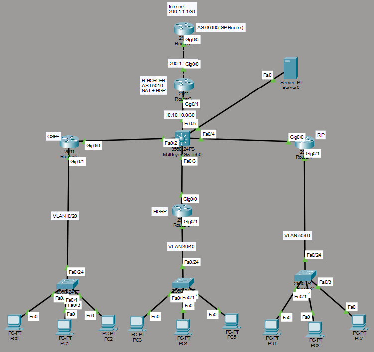

# Enterprise Network Infrastructure Lab

## Overview

This project is a Cisco Packet Tracer simulation designed to demonstrate the implementation of multiple enterprise networking technologies within a single integrated network environment.

The lab combines dynamic routing protocols, route redistribution, VLAN segmentation, centralized DHCP services, NAT/PAT, and eBGP connectivity to simulate a real-world enterprise network architecture.

---

## Technologies Implemented

* VLAN Segmentation
* 802.1Q Trunking
* Router-on-a-Stick
* Inter-VLAN Routing
* Centralized DHCP Server
* OSPF
* EIGRP
* RIP Version 2
* Route Redistribution
* NAT/PAT Overload
* eBGP Peering
* Multilayer Switching
* Server Farm Integration

---

## Network Topology



---

## Architecture Overview

The network is divided into several routing domains:

### OSPF Domain

* VLAN 10
* VLAN 20

### EIGRP Domain

* VLAN 30
* VLAN 40

### RIP v2 Domain

* VLAN 50
* VLAN 60

### Core Layer

* Multilayer Switch (MLS)
* Route Redistribution Point
* Centralized DHCP Services

### Edge Layer

* Border Router
* NAT/PAT
* eBGP Connection to ISP

### Data Center

* VLAN 70
* Internal Services Server

---

## IP Addressing Plan

| Network         | Description      |
| --------------- | ---------------- |
| 192.168.10.0/24 | VLAN 10          |
| 192.168.20.0/24 | VLAN 20          |
| 192.168.30.0/24 | VLAN 30          |
| 192.168.40.0/24 | VLAN 40          |
| 192.168.50.0/24 | VLAN 50          |
| 192.168.60.0/24 | VLAN 60          |
| 172.16.70.0/24  | Data Center VLAN |
| 10.10.10.0/30   | MLS ↔ Border     |
| 10.10.20.0/30   | MLS ↔ OSPF       |
| 10.10.30.0/30   | MLS ↔ EIGRP      |
| 10.10.40.0/30   | MLS ↔ RIP        |
| 200.1.1.0/30    | Border ↔ ISP     |

---

## Routing Design

The project demonstrates interoperability between multiple routing protocols.

* OSPF is deployed for the first branch segment.
* EIGRP is deployed for the second branch segment.
* RIP v2 is deployed for the third branch segment.
* The Multilayer Switch performs route redistribution between all routing domains.
* The Border Router provides external connectivity through eBGP.

---

## DHCP Centralization

A centralized DHCP service is hosted on the Multilayer Switch.

All branch routers utilize DHCP Relay (IP Helper Address) to forward client requests to the DHCP server.

Benefits:

* Simplified management
* Reduced configuration overhead
* Centralized IP address allocation

---

## NAT/PAT Configuration

The Border Router performs PAT (Port Address Translation) to allow internal networks to access external resources through a single public IP address.

Features:

* Dynamic NAT Overload
* Internet Access Simulation
* Address Conservation

---

## Validation Results

| Feature                 | Status |
| ----------------------- | ------ |
| VLAN Configuration      | ✅      |
| Trunking                | ✅      |
| Inter-VLAN Routing      | ✅      |
| DHCP                    | ✅      |
| OSPF                    | ✅      |
| EIGRP                   | ✅      |
| RIP v2                  | ✅      |
| Route Redistribution    | ✅      |
| NAT/PAT                 | ✅      |
| eBGP                    | ✅      |
| End-to-End Connectivity | ✅      |

---

## Verification Commands

Examples of validation commands used during testing:

```bash
show vlan brief
show interfaces trunk
show ip route
show ip ospf neighbor
show ip eigrp neighbors
show ip route rip
show ip bgp summary
show ip nat statistics
show ip dhcp binding
```

---

## Troubleshooting Highlights

### DHCP Relay Issue

Problem:
Clients were unable to obtain IP addresses dynamically.

Root Cause:
Incorrect trunk port configuration between routers and access switches.

Resolution:
Configured 802.1Q trunking on router-facing interfaces and verified helper-address settings.

---

### NAT Verification

Problem:
NAT translations were not appearing.

Resolution:
Generated external traffic and validated operation using:

```bash
show ip nat statistics
```

---

## Repository Structure

```text
enterprise-network-lab/
│
├── packet-tracer/
├── configs/
├── verification/
├── screenshots/
└── topology/
```

---

## Skills Demonstrated

* Cisco IOS Configuration
* Enterprise Network Design
* Dynamic Routing
* Route Redistribution
* VLAN Architecture
* DHCP Services
* NAT/PAT
* eBGP Connectivity
* Network Troubleshooting
* Documentation and Validation

---

## Author

Muhammad Iqbal Hafidz

Cisco Networking Portfolio Project
